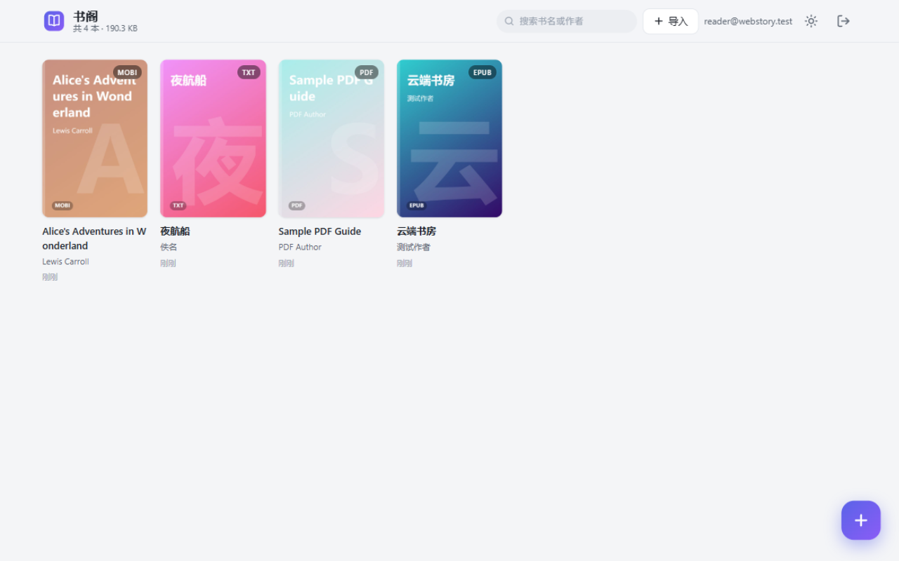
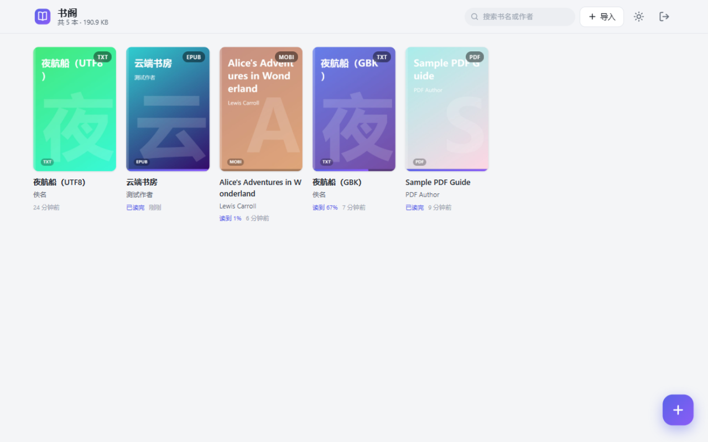
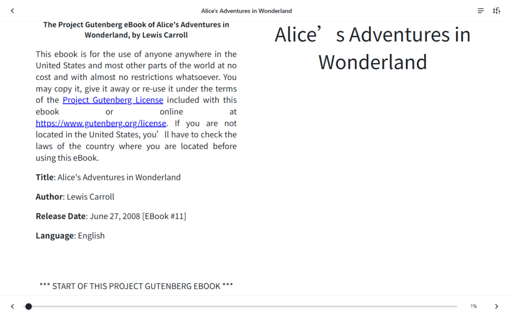
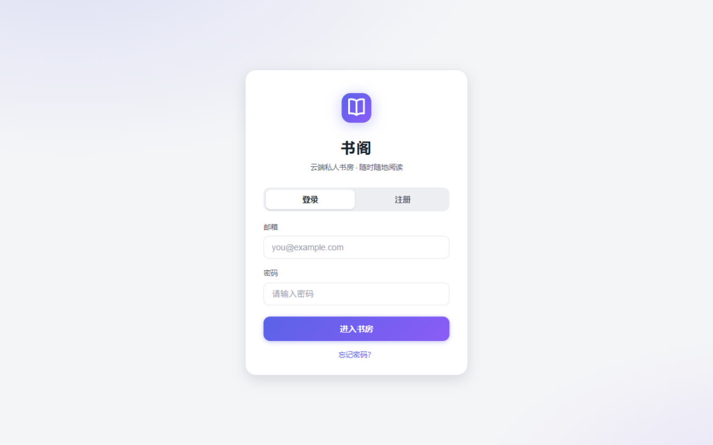
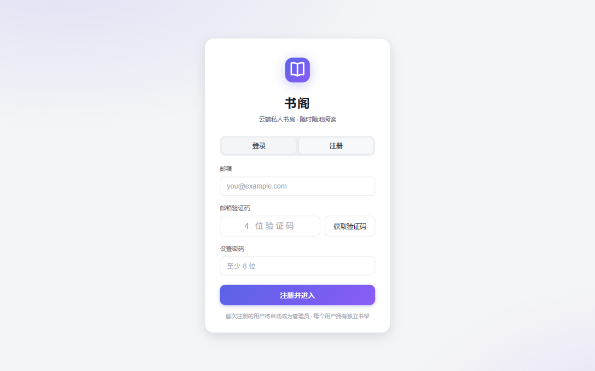
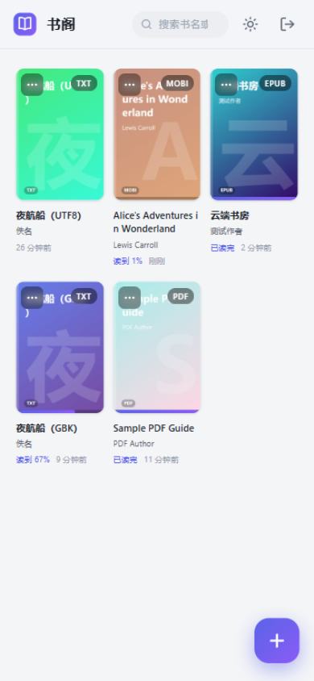
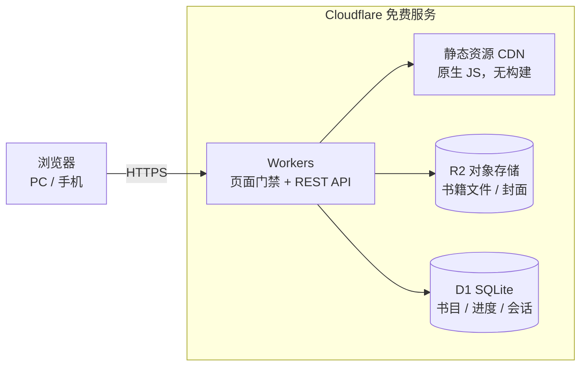

<div align="center">

# 📚 书阁 · Web Story

**基于 Cloudflare 免费服务的私人电子书阅读平台**

无需服务器 · 全球 CDN 加速 · PC / 手机浏览器自适应 · 完全免费额度运行

[](https://deploy.workers.cloudflare.com/?url=https://github.com/junwindxqw/cloudflare_web_story)
[](LICENSE)
[](https://workers.cloudflare.com/)
[](#-格式支持)

[功能特性](#-功能特性) · [快速部署](#-快速部署) · [使用说明](#-使用说明) · [常见问题](#-常见问题)



</div>

---

## ✨ 功能特性

- **📖 多格式阅读** — 支持 **EPUB / MOBI / AZW3 / FB2 / CBZ**（foliate-js 引擎，含分页、目录、双页排版）与 **PDF**（pdf.js 流式加载、缩放、夜间反色），**TXT** 自研分页引擎并自动识别 **UTF-8 / GBK / GB18030 编码**，中文小说无乱码
- **📗 精美书架** — 首页即书架：自动提取书名 / 作者 / 封面；没有封面的书会按标题生成好看的渐变封面；显示阅读进度、最近阅读时间与格式徽标
- **▶️ 继续阅读** — 书架顶部自动置顶最近在读的一本书：封面 + 进度 + 一键继续，省去滚动查找
- **📌 阅读进度云端同步** — 进度自动保存到 D1，换设备打开同一本书自动续读；支持「从头开始」重置
- **🗑️ 真删除** — 删除书籍时同时从 R2 存储移除原文件与封面、清除 D1 元数据，不是软删除
- **👥 多用户 + 邮箱验证码注册** — 邮箱注册时发送 **4 位数字验证码**（10 分钟有效、60 秒重发冷却、防爆破限制），验证通过才能注册；**首个注册的用户自动成为管理员**；支持**邮箱找回密码**
- **🔒 账号安全** — 密码使用 PBKDF2-SHA256（10 万次迭代加盐）存储，会话 Cookie 为 HttpOnly + Secure + SameSite，登录失败限速，API 做同源校验
- **📚 独立书架** — 每个用户拥有自己的书架，互不可见；管理员可管理（删除）任何用户的书籍以管控存储
- **📱 双端自适应** — 响应式布局：手机网格、桌面多列、触摸滑动翻页、点击呼出工具栏、深浅色主题跟随系统
- **🎨 阅读体验** — 白色 / 羊皮纸 / 夜间三种阅读背景，**字号 / 行距 / 字体（默认 / 宋体 / 黑体）** 三维度调节，目录抽屉，进度滑杆快捷跳转，**屏幕常亮** 防止夜间熄屏
- **⌨️ 键盘翻页** — `←` / `→` / `PageUp` / `PageDown` / `Space` 翻页，`Home` / `End` 跳到首/末页，点击左右 1/3 区域翻页、中央呼出工具栏
- **📲 手机端细节** — 登录页 input 16px 防 iOS 缩放、密码可见切换、验证码全宽按钮；书架顶栏折叠式搜索、菜单按钮常显、长按 500ms 防误触；阅读器顶/底栏触控热区加大、设置面板变底部抽屉、字号自适应（手机默认 20、桌面 18）、从屏幕顶部下滑呼出隐藏的工具栏
- **💸 全免费额度** — Workers + R2 + D1 均在免费额度内运行，个人使用绰绰有余

<details>
<summary>📖 更多截图</summary>

| 夜间阅读 | MOBI 双页排版 |
| :---: | :---: |
|  |  |

| 登录页 | 注册（邮箱验证码） |
| :---: | :---: |
|  |  |

| 移动端书架 | 夜间阅读 |
| :---: | :---: |
|  |  |

</details>

## 🧱 架构

全部运行在 Cloudflare 免费服务上，一个 Worker 同时承载前端页面与后端 API：



| 组件 | 职责 |
| --- | --- |
| **Workers**（含静态资源） | 登录门禁、REST API、文件流式转发（支持 `Range` 分段，PDF 秒开） |
| **R2** | 存储书籍原文件与 JPEG 封面，删除时同步移除 |
| **D1** | 用户 / 会话 / 邮箱验证码 / 书目元数据 / 阅读进度；**表结构首次访问自动创建并自动迁移**，无需手动操作 |
| **前端** | 零构建原生 ES Modules；pdf.js + foliate-js + jszip 全部本地化托管，无外部 CDN 依赖 |

## 🚀 快速部署

### 方式一：一键部署（推荐）

1. 把本仓库推送到你的 GitHub 账号
2. 点击上方 **Deploy to Cloudflare** 按钮（或访问 `https://deploy.workers.cloudflare.com/?url=<你的仓库地址>`）
3. 在部署配置中确认环境变量（见[配置说明](#️-配置说明)）
4. Cloudflare 会自动创建 R2 存储桶、D1 数据库并完成绑定与部署
5. 部署完成后，在 Worker 设置中添加 Secret：`wrangler secret put RESEND_API_KEY`（邮件服务密钥，见下文）
6. 访问分配的 `*.workers.dev` 域名，**第一个注册的账号自动成为管理员**

### 方式二：命令行部署

```bash
# 0) 克隆并安装依赖
git clone https://github.com/junwindxqw/cloudflare_web_story.git
cd cloudflare_web_story
npm install

# 1) 登录 Cloudflare（浏览器授权）
npx wrangler login

# 2) 配置邮件服务：
#    在 https://resend.com 免费注册（100 封/天），添加并验证发信域名，
#    修改 wrangler.jsonc 中的 MAIL_FROM，然后：
npx wrangler secret put RESEND_API_KEY

# 3) 一键创建 R2 / D1 资源并回填配置
npm run setup

# 4) 部署
npm run deploy
```

> 💡 **本地开发无需配置邮件**：未配置 `RESEND_API_KEY` 时，验证码会直接打印在 `wrangler dev` 的终端日志里；也可临时把 `DEV_SHOW_CODE` 设为 `"true"` 让接口直接返回验证码（仅限本地，线上务必保持 `false`）。

### 本地开发

```bash
npm install
npm run dev        # http://127.0.0.1:8787 （本地模拟 R2 / D1，无需 Cloudflare 账号）
```

## ⚙️ 配置说明

`wrangler.jsonc` 中的主要配置：

| 配置 | 默认值 | 说明 |
| --- | --- | --- |
| `vars.MAIL_FROM` | `书阁 <noreply@your-domain.com>` | 发件人地址，**需改为 Resend 已验证域名下的地址** |
| secret `RESEND_API_KEY` | 未设置 | [Resend](https://resend.com) API Key（免费 100 封/天）；未配置时验证码仅打印到 Worker 日志（适合本地开发） |
| `vars.DEV_SHOW_CODE` | `false` | 为 `"true"` 时验证码同时返回在接口响应中，**仅限本地调试，线上必须为 false** |
| `vars.MAX_UPLOAD_MB` | `100` | 单文件上传上限（Cloudflare 免费版请求体上限 100MB） |
| `r2_buckets[].bucket_name` | `web-story-books` | R2 存储桶名 |
| `d1_databases[].database_name` | `web-story-db` | D1 数据库名 |

> 💡 也可以用 `npx wrangler secret put AUTH_PASSWORD` 以 Secret 方式配置密码，避免明文出现在配置文件中。
> 💡 修改账号密码后重新 `npm run deploy` 即可生效。

## 📖 使用说明

| 操作 | 方式 |
| --- | --- |
| 注册账号 | 登录页「注册」→ 输入邮箱获取 4 位验证码（10 分钟有效）→ 设置密码；**首个注册的用户自动成为管理员** |
| 找回密码 | 登录页「忘记密码？」→ 邮箱验证码 → 设置新密码，重置后全端重新登录 |
| 导入书籍 | 右下角 **➕** 悬浮按钮或顶部「导入」，支持多选，自动提取书名 / 作者 / 封面 |
| 阅读 | 点击书架封面；有进度的书自动续读 |
| 翻页 | 点击左右 1/3 区域、左右方向键、`PageUp`/`PageDown`/`Space`、触摸滑动；`Home`/`End` 跳到首末页；PDF 为滚动模式 |
| 工具栏 | 点击屏幕中央或滚动 PDF 呼出 / 隐藏 |
| 目录 | 顶栏 ☰；EPUB / TXT（自动识别章节标题）/ MOBI 均支持 |
| 阅读背景 / 字号 / 行距 / 字体 | 顶栏 ⚙：白色、羊皮纸、夜间三种背景 + 字号步进器 + 行距（紧凑 / 标准 / 宽松）+ 字体（默认 / 宋体 / 黑体）+ 屏幕常亮（PDF 自动用缩放替代字号行距字体） |
| 删除 / 重置进度 | 封面左上角 **⋯**（或手机长按封面）：彻底删除、从头开始 |

**格式支持**

| 格式 | 打开 | 目录 | 进度续读 | 编码 |
| --- | :-: | :-: | :-: | --- |
| EPUB | ✅ | ✅ | ✅（CFI 精确定位） | — |
| PDF | ✅ | — | ✅（页码） | — |
| TXT | ✅ | ✅（章节标题识别） | ✅（按比例） | UTF-8 / GBK / GB18030 自动识别 |
| MOBI / AZW3 | ✅ | ✅ | ✅ | — |
| FB2 / CBZ | ✅ | ✅ / — | ✅ | — |

## ❓ 常见问题

<details>
<summary><b>上传大小有限制吗？</b></summary>
Cloudflare 免费版单请求上限 100MB，超过会返回 413。可用 <code>MAX_UPLOAD_MB</code> 配置更小的自定义上限。文件通过流式转存 R2，不会占用 Worker 内存。
</details>

<details>
<summary><b>删除书籍后文件真的被删了吗？</b></summary>
是的。删除时同步调用 R2 移除原文件与封面，并删除 D1 元数据，没有任何软删除或回收站。
</details>

<details>
<summary><b>忘记密码怎么办？</b></summary>
登录页点击「忘记密码？」，用注册邮箱接收 4 位验证码即可设置新密码；重置后所有已登录会话会自动失效。
</details>

<details>
<summary><b>多用户之间数据是隔离的吗？</b></summary>
是的。每个用户只能看到、阅读、删除自己书架上的书；唯一的例外是管理员（首个注册用户）可以删除任何用户的书籍，用于管控共享的存储空间。
</details>

<details>
<summary><b>一定要配置 Resend 吗？</b></summary>
线上部署必须配置，否则无法发送验证码邮件、无法注册。Resend 免费额度 100 封/天，对私人平台绰绰有余；需要在 Resend 验证一个发信域名（可用自己的域名配 DNS）。本地开发则不需要——验证码直接打印在 <code>wrangler dev</code> 日志中。
</details>

<details>
<summary><b>TXT 中文乱码？</b></summary>
阅读器会自动尝试 UTF-8（严格校验），失败后回退 GB18030 解码，覆盖绝大多数简体中文 TXT；带 BOM 的 UTF-16 也能正确识别。
</details>

<details>
<summary><b>免费额度够用吗？</b></summary>
个人使用完全足够：Workers 免费 10 万请求/天，R2 免费 10GB 存储，D1 免费 5GB。静态资源由 CDN 直接分发，不消耗 Worker 请求额度。
</details>

## 🧰 技术栈

- **后端**：Cloudflare Workers（原生 JS，无框架）、R2 流式存储、D1、PBKDF2 密码哈希 + Cookie 会话、Resend 邮件（可插拔，未配置时回退日志）
- **前端**：原生 ES Modules + CSS 变量主题，无构建步骤
- **阅读引擎**：[foliate-js](https://github.com/johnfactotum/foliate-js)（EPUB / MOBI / AZW3 / FB2 / CBZ）、[pdf.js](https://github.com/mozilla/pdf.js)（PDF）、自研分栏分页（TXT）
- **其他**：JSZip（EPUB 元数据提取）、Canvas 动态封面生成

## 📂 目录结构

```
cloudflare_web_story/
├── src/worker/            # Cloudflare Worker 后端
│   ├── index.js           #   路由入口：页面门禁 + API 分发 + 安全响应头
│   ├── auth.js            #   多用户认证：注册/登录/验证码/找回密码/会话 + 自动建表迁移
│   ├── mailer.js          #   验证码邮件（Resend，本地回退打印日志）
│   └── books.js           #   书架 API：上传 / 封面 / 文件(Range) / 进度 / 删除（按用户隔离）
├── public/                # 前端（无构建，直接部署为静态资源）
│   ├── login.html         # 登录页
│   ├── index.html         # 我的书架
│   ├── reader.html        # 阅读器外壳
│   ├── css/  js/          # 样式与逻辑（readers/ 内为各格式阅读引擎）
│   └── vendor/            # 本地化的 pdf.js / foliate-js / jszip
├── scripts/
│   ├── setup.js           # 一键创建 R2 / D1 并回填 wrangler.jsonc
│   └── vendor.js          # 第三方库落位（npm install 自动执行）
├── docs/images/           # 截图
└── wrangler.jsonc         # Cloudflare 配置（资源绑定 + 账号变量）
```

## 🔒 安全说明

- 密码存储：PBKDF2-SHA256，10 万次迭代 + 每用户随机盐，不存明文
- 邮箱验证码：4 位数字、10 分钟有效、60 秒重发冷却、连续错 6 次作废；找回密码接口对不存在的邮箱返回统一响应，防止账号枚举
- 会话 Cookie：`HttpOnly` + `Secure` + `SameSite=Lax`，30 天有效；重置密码后强制下线所有会话
- 登录失败限速（5 分钟 10 次）；所有变更类 API 做同源校验（Origin / Sec-Fetch-Site）
- 页面按路由下发 CSP；书籍文件仅登录后可读且按归属校验，上传键位由服务端生成，杜绝路径拼接
- 阅读器渲染书籍内容时禁用内嵌脚本执行（foliate 渲染于隔离的 Shadow DOM）

## 📄 License

[MIT](LICENSE)
